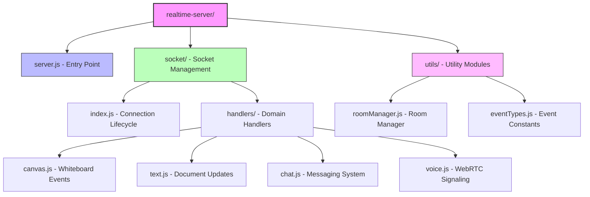

# Chapter 3. Real-time System

## 3.1. System Overview
The Real-Time Collaboration System serves as the core engine that enables multiple users to interact simultaneously within a shared workspace. It supports the main collaborative functions of the platform, including canvas drawing, text editing, chat messaging, and voice communication. To ensure high performance and maintain a clear separation of concerns, the real-time subsystem is decoupled from the main backend implemented with FastAPI. Instead, it operates as an independent Node.js server dedicated to handling latency-sensitive real-time events. Following an event-driven architecture, this server efficiently processes transient interactions such as drawing updates, text modifications, chat messages, and voice signaling with minimal delay.

## 3.2. Core Technologies
The real-time subsystem is built upon three main technologies: Node.js with Express, Socket.IO, and WebRTC. Node.js and Express provide a non-blocking, asynchronous runtime environment capable of handling a large number of concurrent connections efficiently, making them well suited for real-time applications. Socket.IO enables bidirectional communication between clients and the server, while also providing useful built-in features such as automatic reconnection, event broadcasting, and logical user grouping through rooms. In parallel, WebRTC is used to support peer-to-peer voice communication, allowing audio streams to be exchanged directly between clients with reduced latency and lower server bandwidth usage. Together, these technologies form the technical foundation of the real-time collaboration system.

## 3.3. System Architecture
The real-time server is designed as a stateless system that functions as both a traffic controller and a signaling relay. It does not store persistent data such as canvas content or text documents; instead, long-term storage is delegated to the FastAPI backend through standard HTTP requests. This design reduces server bottlenecks and improves scalability. 

The modularized structure of the real-time server is organized as follows:


*Figure 3.3. Hierarchical structure of the Real-Time Server*

The system is modularized into several main components: the **Connection Lifecycle module**, which manages socket initialization and disconnection cleanup; the **Room Manager**, which maintains in-memory structures for tracking users within collaborative workspaces; and the **Domain Handlers**, which organize feature-specific event handlers for canvas drawing, text editing, chat messaging, and voice communication.

## 3.4. Room Management and Data Isolation
To support multiple collaborative workspaces simultaneously, the system uses the Socket.IO Rooms feature to logically separate user sessions and shared events. When a user accesses a workspace, the client emits a `join_board` event containing a unique `board_id`, and the server assigns that socket connection to the corresponding room. All subsequent events are isolated within their respective rooms, ensuring that activities from one workspace do not affect another. In addition, the system tracks user presence through a custom room manager, which maintains a list of active users and emits events such as `user_joined` and `room_users`. This mechanism allows the frontend to display accurate real-time participant information and helps maintain consistency within each collaborative session.

## 3.5. Event-Driven Synchronization Strategies
The system adopts different synchronization strategies depending on the type of data being transmitted, in order to balance responsiveness, consistency, and network efficiency. For highly interactive features such as canvas drawing and text editing, an optimistic UI update strategy is applied. When a user performs an action, the client immediately updates the local interface to provide a smooth and responsive experience. Instead of transmitting the entire application state, only a small delta payload, such as drawing coordinates or text modifications, is sent to the server. The server then broadcasts this update to all other users in the same room using `socket.to(board_id).emit()`, excluding the original sender. This approach reduces redundant rendering, avoids infinite feedback loops, and preserves an efficient synchronization flow across clients.

For chat messaging, the system uses a server-authoritative synchronization strategy, where consistency and correct message ordering are more important than immediate local rendering. When a message is sent, it is first processed by the server, which assigns a timestamp such as `sent_at` to maintain a unified conversation timeline. The message is then broadcast to all users in the room, including the sender, through `io.to(board_id).emit()`. As a result, all participants receive an identical and fully synchronized chat history, ensuring reliability and coherence in communication. By combining these two strategies, the system is able to provide both low-latency interaction and consistent shared state depending on the requirements of each feature.

## 3.6. Real-Time Voice Communication

```mermaid
sequenceDiagram
    participant NewUser as New Participant
    participant Server as Node.js Signaling Server
    participant ExistingUser as Existing Participant

    Note over NewUser, ExistingUser: 1. Discovery Phase
    NewUser->>Server: VOICE_JOIN (board_id)
    Server->>ExistingUser: VOICE_JOIN (from_socket_id)

    Note over NewUser, ExistingUser: 2. Offer / Answer Exchange
    ExistingUser->>ExistingUser: Generate WebRTC Offer
    ExistingUser->>Server: VOICE_OFFER (SDP, target_socket_id)
    Server->>NewUser: VOICE_OFFER (SDP)
    
    NewUser->>NewUser: Generate WebRTC Answer
    NewUser->>Server: VOICE_ANSWER (SDP, target_socket_id)
    Server->>ExistingUser: VOICE_ANSWER (SDP)

    Note over NewUser, ExistingUser: 3. ICE Candidate Exchange
    NewUser-->>Server: VOICE_ICE_CANDIDATE
    Server-->>ExistingUser: VOICE_ICE_CANDIDATE
    ExistingUser-->>Server: VOICE_ICE_CANDIDATE
    Server-->>NewUser: VOICE_ICE_CANDIDATE

    Note over NewUser, ExistingUser: 4. Audio Transmission
    NewUser<-->>ExistingUser: Direct Peer-to-Peer Audio Stream (WebRTC)
```

*Figure 3.6. Sequence Diagram for Voice Chat Interaction*

The system supports low-latency voice communication through WebRTC, while the Node.js server acts as a signaling intermediary. The server does not process actual audio streams; instead, it facilitates the exchange of connection metadata required to establish peer-to-peer communication between clients. The signaling process consists of several main steps. First, during the discovery phase, a user joining a voice channel notifies other users in the same room. Second, in the offer/answer exchange, existing participants generate WebRTC offers and send them to the new participant, who responds with the corresponding answers. Third, during the ICE candidate exchange, network connectivity information is transmitted through the signaling server. Finally, once the connection is established, audio streams are transmitted directly between clients in a peer-to-peer manner, minimizing latency and reducing server load.
